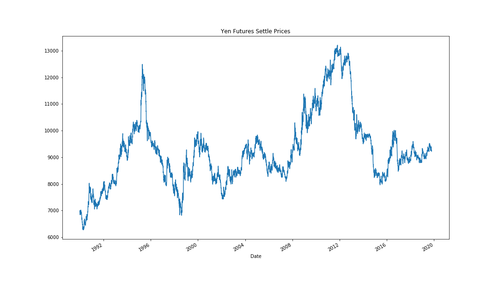
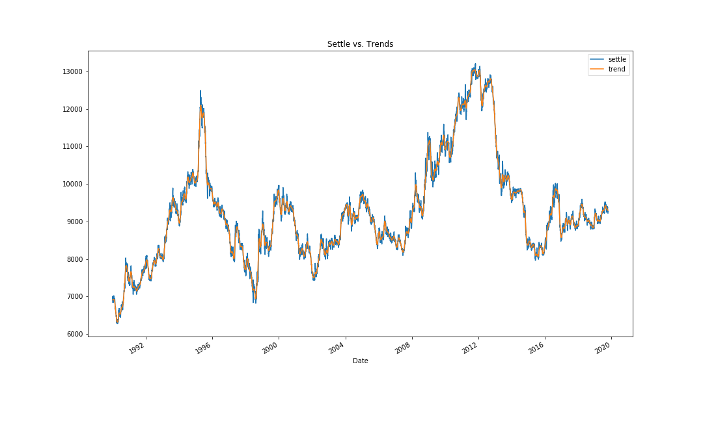
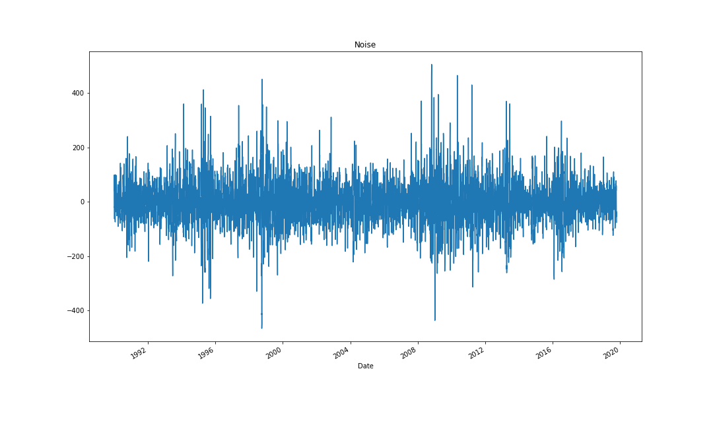
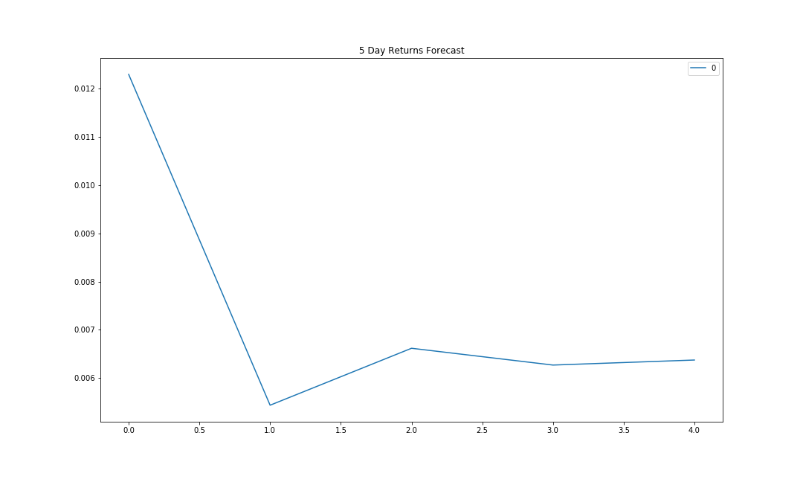
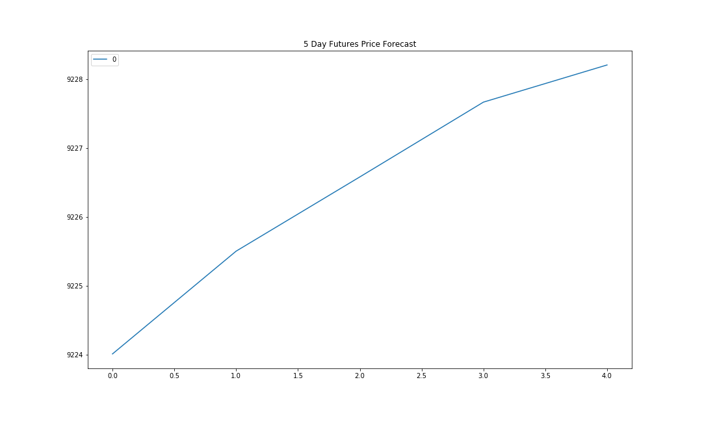
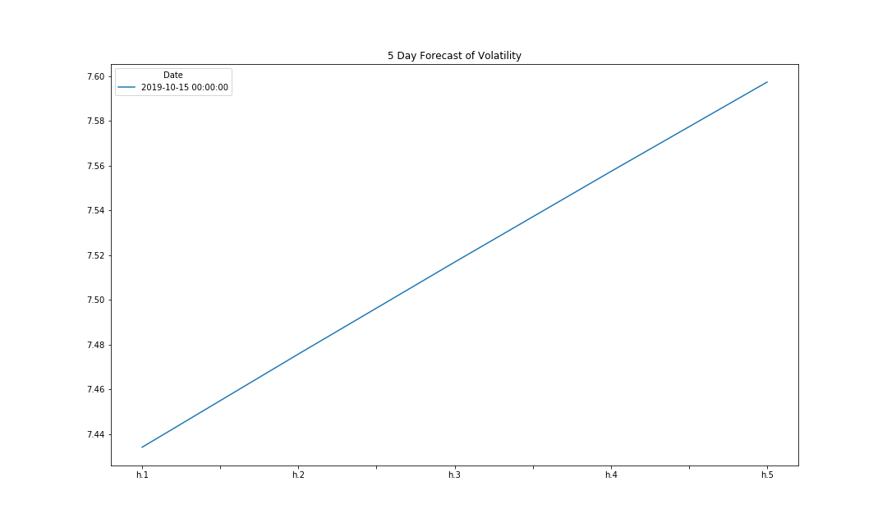
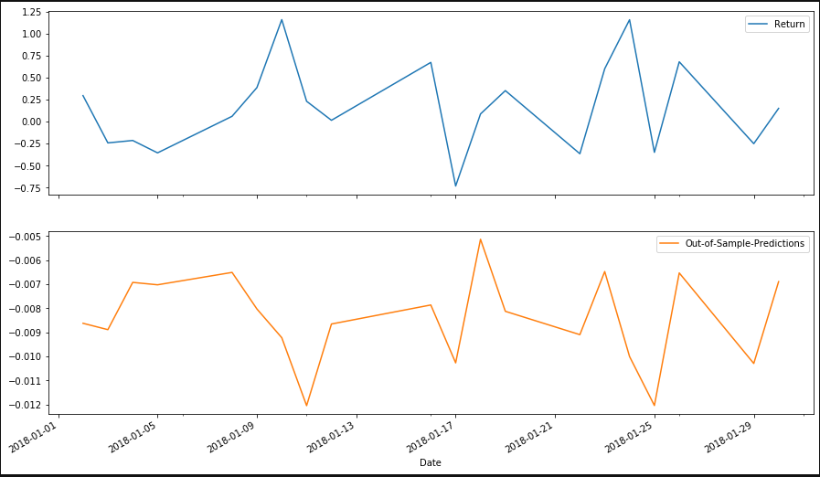

# **time_series_homework_uw_fintech**

## **Time-Series Forecast (Part I)**
Based on the below time-series analysis on the Dollar-Yen exchange rate, I would recommending a HOLD on buying the yen within the upcoming 5-day period. Our GARCH model indicates that volality, thereforce risk, will increase, further supported by our ARMA model which indicates a relatively large drop in returns within the first 2 trading days. Our ARIMA model furthers this conclusion in forecasting a slow-down to netural price trajectory. Utilizing these 3 sources of truth, I feel somewhat confident in the conclusion, but would like to compare these models up against other iterations of the models with various parameters for more certainity in my conclusions for the next 5-days.

### *Yen Futures Trends*

### *Settle vs. Trends*

### *Settle Noise*

### *5 Day ARMA Returns Forecast*

### *5 Day ARIMA Future Price Forecast*

### *5 Day GARCH Volatility Forecast*

## **Linear Regression Forecasting (Part II)**
Using SKLearn linear regression to predict Yen futures ("settle")returns with lagged Yen futures returns, the Out-of-sample Performance of 0.415 is better than the In-sample Performance of 0.596 since it is lower. Given that there a difference between the insample and out of sample forecasts, it not an ideal model to put in production as greater than 0.5 indicated a poor quality model and even though out-of-sample is slightly better, overall the model performed poorly.

### *First 20 Days of Out-of-Sample Prediction*
